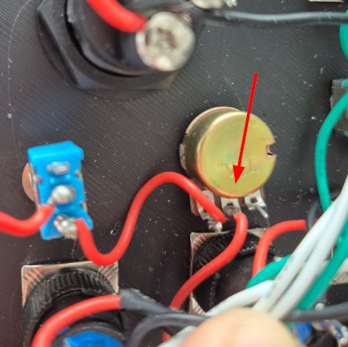
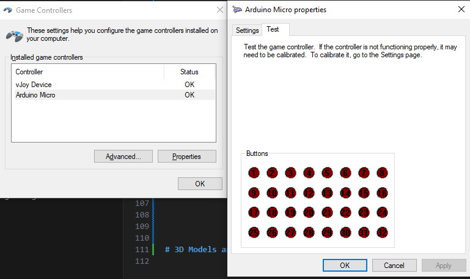

# Parts list

| Item                  | Configuration                | Cost order + Shipping    | Cost per unit | Units needed | Link                                                                                                                                                                                                                                                                                                                                                                                                                                                                                                                                                                                                                                              |
|-----------------------|------------------------------|--------------------------|---------------|--------------|---------------------------------------------------------------------------------------------------------------------------------------------------------------------------------------------------------------------------------------------------------------------------------------------------------------------------------------------------------------------------------------------------------------------------------------------------------------------------------------------------------------------------------------------------------------------------------------------------------------------------------------------------|
| Square Button         | 3-6V   1NO 1NC 5PCS   Self reset | 5.59€                    | 5.59€         | 2            | [Here](https://de.aliexpress.com/item/1005005791728074.html?channel=twinner)                                                                                                                                                                                                                                                                                                                                                                                                                                                                                                                                                                      |
| Engine Start button   | -                            | 3.75€                    | 3.75€         | 1            | [Here](https://de.aliexpress.com/item/1005007038224850.html?spm=a2g0o.detail.pcDetailTopMoreOtherSeller.1.1f583x8E3x8EFs&gps-id=pcDetailTopMoreOtherSeller&scm=1007.40050.354490.0&scm_id=1007.40050.354490.0&scm-url=1007.40050.354490.0&pvid=5076895b-e31f-49f9-b2b2-804f4f98032d&_t=gps-id:pcDetailTopMoreOtherSeller,scm-url:1007.40050.354490.0,pvid:5076895b-e31f-49f9-b2b2-804f4f98032d,tpp_buckets:668%232846%238115%232000&pdp_npi=4%40dis%21EUR%217.49%213.75%21%21%2157.10%2128.55%21%40211b617b17275174681276900e10f4%2112000039180054877%21rec%21DE%216003558799%21X&utparam-url=scene%3ApcDetailTopMoreOtherSeller%7Cquery_from%3A) |
| Mini On/On Switch     | -                            | 2.54€                    | 0.25€         | 1            | [Here](https://de.aliexpress.com/item/32809087410.html?spm=a2g0o.order_list.order_list_main.114.6b865c5fyQg7GB&gatewayAdapt=glo2deu)                                                                                                                                                                                                                                                                                                                                                                                                                                                                                                              |
| Linear Potentionmeter | 1K Ohm                       | 2.59€                    | 0.26€         | 1            | [Here](https://de.aliexpress.com/item/1005006659172507.html?spm=a2g0o.order_list.order_list_main.119.6b865c5fyQg7GB&gatewayAdapt=glo2deu)                                                                                                                                                                                                                                                                                                                                                                                                                                                                                                         |
| Round Button          | 3.6-6V   1NO1NC   Momentary      | 13.01€                   | 0.62€         | 12           | [Here](https://de.aliexpress.com/item/33058529397.html?spm=a2g0o.order_list.order_list_main.124.6b865c5fyQg7GB&gatewayAdapt=glo2deu)                                                                                                                                                                                                                                                                                                                                                                                                                                                                                                              |
| Mini Buttons          | -                            | 5.18€ (2 orders needed!) | 0.52€         | 6            | [Here](https://de.aliexpress.com/item/4000143836281.html?spm=a2g0o.order_list.order_list_main.144.64695c5f431N8n&gatewayAdapt=glo2deu)                                                                                                                                                                                                                                                                                                                                                                                                                                                                                                            |
| EC11 Rotary encoders  | 20MM Plum Handle             | 2.59€                    | 0.52€         | 2            | [Here](https://de.aliexpress.com/item/1005005983134515.html?spm=a2g0o.order_list.order_list_main.143.64695c5f431N8n&gatewayAdapt=glo2deu)                                                                                                                                                                                                                                                                                                                                                                                                                                                                                                         |
| Momentary Switches    | -                            | 4.10€                    | 2.05€         | 2            | [Here](https://de.aliexpress.com/item/32815002670.html?spm=a2g0o.order_list.order_list_main.161.64695c5f431N8n&gatewayAdapt=glo2deu)                                                                                                                                                                                                                                                                                                                                                                                                                                                                                                              |
| Arduino Pro Micro     | Type C                       | 4.99€                    | 2.50€         | 1            | [Here](https://de.aliexpress.com/item/1005006645661865.html?spm=a2g0o.productlist.main.1.45e20FyC0FyC5F&algo_pvid=b56999f0-5b5e-4f29-92ca-05ff74eef665&algo_exp_id=b56999f0-5b5e-4f29-92ca-05ff74eef665-0&pdp_npi=4%40dis%21EUR%2115.12%214.99%21%21%21115.33%2138.06%21%40211b653717275184044866667e386b%2112000037912548501%21sea%21DE%216003558799%21X&curPageLogUid=MPJiCdhrVOnH&utparam-url=scene%3Asearch%7Cquery_from%3A)              
| Diodes 1N4148 DO-35      | Type C                       | 1.29€                    | 0.013€         | 32            | [Here](https://de.aliexpress.com/item/4000142272546.html?spm=a2g0o.order_list.order_list_main.182.64695c5f431N8n&gatewayAdapt=glo2deu)         

**Total cost: 45.63€**

For the parts of which you don't buy in bulk, buy at least 1 extra. A part could be defective or you could break one in the process and to avoid the long waiting times.

## Tools you will need and assume you have laying around:
- Soldering Kit
- Wires
- 9 x M3xL3xD4 Threaded inserts (Knurled nuts for melting)
- 9 x M3x8 (longer should also work)

## Customization and different vendors

You can mix and match the colors of the buttons as you wish. 

If you find a cheaper price of the same part from a different vendor, go for it! Make sure to check if the parts are identical in size, otherwise you might have issues with fitting them into the faceplate.

If you decide on using **different parts** you need to adjust the diameters on the faceplate.

If you aren'ts happy with the placement of the mounting holes of the 3d printed box, I will upload a model without any mounting holes so you can drill them as you need.

# Building the button box
## Preperation

Make sure to bend the pins of the potentiometer as shown in the image, otherwise it won't work.

## Wiring guide

For the wiring I will always highlight certain areas to help with clutter. Make sure to leave some slack on your wire since at the end you will need to solder everthing to your Arduino.

I will also add some IRL images in the beginning for reference.

### Big picture

### Wiring the LEDs

The engine start button needs it's own powersource and needs to be constantly on. Due to the way the part is designed it needs to have a power source to send a signal (if you find a better way to deal with this lmk).

### Wiring the matrix

When wiring the matrix make sure to carefully connect it as shown in the wiring schematic or you might  run into issues.

For the rows make sure that the black stripe of the diode (the small orange thingies) **faces the pin** of the button. If you wire them backwards it won't work. They diodes are **optional** but they prevent [ghosting](https://www.microsoft.com/applied-sciences/projects/anti-ghosting#:~:text=Ghosting%20is%20the%20problem%20that,to%20have%20been%20%E2%80%9Cghosted%E2%80%9D.) from happening so I recommend it.

### Wiring the rotary encoders + Engine Start

### IRL reference

## Uploading the code

1. Download the [Arduino IDE](https://www.arduino.cc/en/software).

2. Make sure to close NZXT CAM if you have it installed since it conflicts with the uploading for some reason.

3. Add the ZIP library in code/libraries/

4. Upload the code 

## Testing

1. Set up usb game controllers

2. Select "Arduino Micro" and click "Properties" 

3. Now make sure that every button gets recognized when pressed

## Troubleshooting

> When pressing a button two are getting pressed at the same time.

This usually happens when you are shorting a columns/row with another. Make sure none of them are touching.

# 3D Models and tutorials I used

https://www.youtube.com/watch?v=wkY1NsbWj5I

https://www.thingiverse.com/thing:4206617